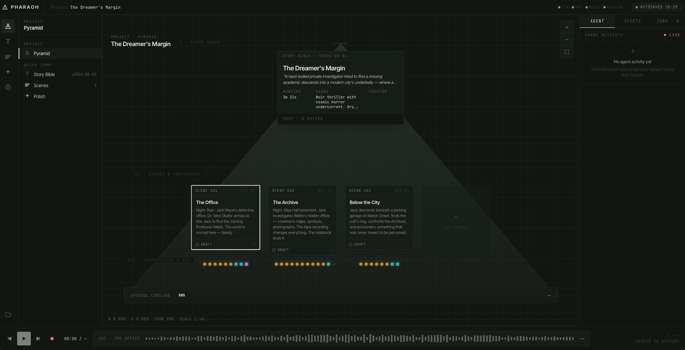
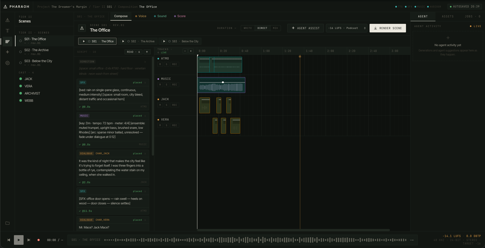
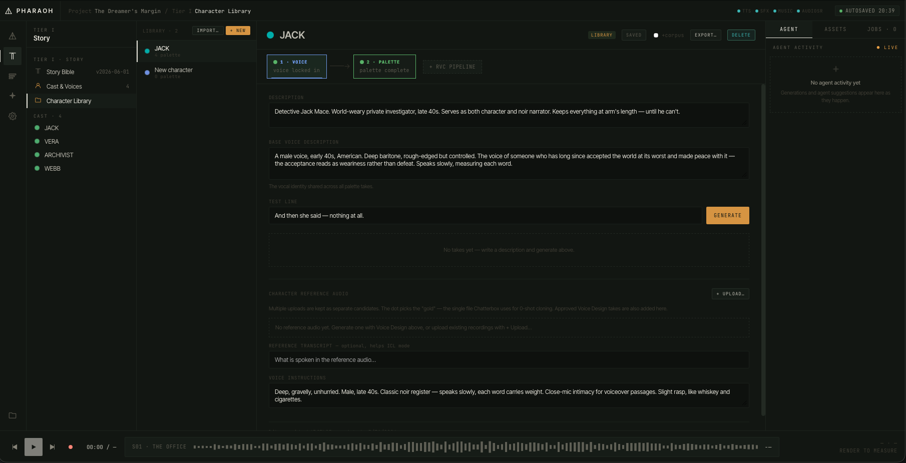
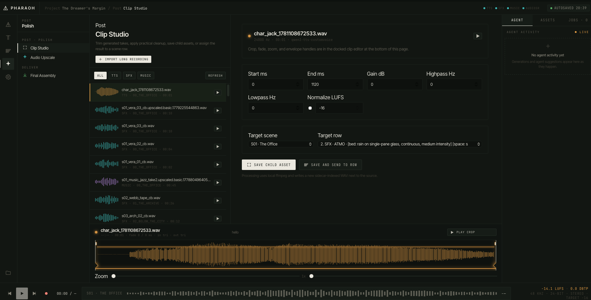

# Pharaoh

AI-powered audio drama production suite. Pharaoh is built around the Pyramid workflow:

```text
Story Bible -> Storyboard -> Script -> Assets -> Composition -> Render
```

The app is meant to be fully operable both by humans in the Tauri GUI and by agents. Agents have two ways in: the **CLI** ([docs/cli.md](docs/cli.md)) — the app's own Rust core, covering everything end to end — and the **MCP server** ([docs/mcp.md](docs/mcp.md)) for MCP clients such as Claude Desktop and Claude Code. All three use the same project files, script rows, sidecar metadata and inference servers.



<p align="center"><em>Pyramid view: the story bible at the apex, scenes and their assets below, episode timeline at the base.</em></p>

## Audio Drama Agent Skill

Pharaoh includes a portable [audio drama production skill](skills/pharaoh-audio-drama/README.md)
for agents: prose-to-Fountain adaptation, casting, explicit acting direction,
retakes, sound placement, performance review, and delivery. Start with its
[SKILL.md](skills/pharaoh-audio-drama/SKILL.md), or copy the complete folder into
your agent's skill directory. It uses your configured Pharaoh installation;
voices, models, source material, and inference services are not bundled with it.

## What It Is

Pharaoh is a Tauri 2 desktop app (React + TypeScript frontend, Rust backend) connected to local or remote Python inference servers. The servers are usually on a Linux GPU box; the app and CLI upload inputs and download results themselves, so the two machines don't need a shared disk.

| Port | Service | Engine (fallback) |
|------|---------|-------------------|
| 18000 | MCP | Agent control plane — no models |
| 18001 | TTS | **Breeze TTS 2**: voice cloning with performed direction and vocal events (Qwen3-TTS, which clones without direction, where Breeze isn't installed) |
| 18002 | SFX | **MOSS-SoundEffect v2**: effects and beds up to 30 s (Woosh, AudioLDM) |
| 18003 | Music | **YuE2**, instrumental by default (ACE-Step on Macs; ACE-Step also does repaint/cover) |
| 18004 | Post | AudioSR clean-up / upscaling |
| 18006 | RVC | Optional voice lock: training and conversion (Applio) |
| 18007 | Dissect | Voices from recordings: separation, diarization, transcription, emotion tagging |

The server and model choices come from blind listening tests (`docs/voice-pipeline.md` has the voice-lock one).

## What It Does

**Writing**
- Pyramid project view: story bible, scenes as plates (stacked in rows that widen downward for long projects, or one row per act), episode timeline. Projects persist under `~/pharaoh-projects`.
- Fountain scene editor with audio-drama cues (`SFX:`, `BED:`, `MUSIC:`), `# Act` sections, one-click vocal-event chips (`[laughs]`, `[sighs]`, `[whispers]`…), and live compilation to script rows.
- LLM scene drafting/revision (Anthropic) when `ANTHROPIC_API_KEY` is set.

**Voices**
- Character Library: each character's gold reference clip, emotional palette (named emotions with written direction and real reference lines), and optional voice lock.
- Voices from existing recordings (Dissect): separate dialogue from music and effects, find each speaker, transcribe, and score every line's emotion; name speakers into the Library; fill palettes from a character's real lines.
- Rebuild a whole recording (an audiobook, a radio play) into an editable project, using the voices named in the review.
- Dialogue through Breeze: clone the character (or the palette emotion's reference), perform the line's direction ("furious, voice rising"), with a Whisper take check that retakes lines it mis-hears.
- Optional voice lock: an RVC model trained on a character's real lines, applied to calm lines after Breeze (it flattens whispers, sighs, laughs and anger, so those keep Breeze's take).
- Optional AudioSR clean-up on every take.
- Cast tools: merge characters, match unnamed rebuild voices to named ones, export the whole cast (or some) as a `.pharaoh-cast` pack, import packs and character files into any project.

**Sound and music**
- Sound effects and beds through MOSS-SoundEffect; Woosh and AudioLDM selectable.
- Score through YuE2 or ACE-Step with duration, BPM, key, lyrics and reference audio.

**Reviewing and mixing**
- Jobs list grouping each line's take, voice lock and AudioSR into one row.
- Compare takes: every take of a line, blind and shuffled, rated 1–5, with Breeze's take check.
- Lay out: place a scene's generated rows on the timeline in script order (also runs automatically after "Gen all dialogue").
- Clip Studio for importing long recordings, cropping, gain/filters/normalization, fade envelopes and sending clips to rows.
- Spatial (binaural) placement: azimuth/elevation dials, waypoint paths for moving sources, Web Audio HRTF preview; renders through ffmpeg `sofalizer` (MIT KEMAR HRTF) or an ITD+ILD fallback.
- Spatial spaces: 13 room presets (vocal booth to cathedral, cave and forest) applied by `afir` convolution — install with `./inference/download_spatial_assets.sh`, which fetches FOSS impulse responses (OpenAir, Aachen AIR) and synthesizes any it can't get (`inference/synth_spatial_irs.py`). Drop a measured IR into `assets/spaces/` with the same filename to upgrade a preset.
- Scene rendering through ffmpeg (placement, gain, fades, pan, looping beds, ducking under dialogue, loudness targets), final episode assembly, and `.m4b` export with chapters.

## Prerequisites

| Tool | Version | Notes |
|------|---------|-------|
| Rust | 1.77+ | `curl --proto '=https' --tlsv1.2 -sSf https://sh.rustup.rs \| sh` |
| Node.js | 20+ | `brew install node` or nodejs.org |
| Python | 3.11+ | Setup creates its own venvs (3.9–3.12 per stack) with uv |
| uv | recent | `brew install uv` or `curl -LsSf https://astral.sh/uv/install.sh \| sh` |
| ffmpeg | recent | `brew install ffmpeg`; render, import, clip processing, resample, normalize |
| SoX | recent | `brew install sox`; Qwen3-TTS reference preprocessing |
| Xcode CLT | macOS | `xcode-select --install` |

The main engines (Breeze, MOSS-SoundEffect, YuE2, Dissect) need Linux with an NVIDIA GPU; a 24 GB card runs Breeze (~12 GB) and MOSS (~9 GB peak) side by side. On a Mac, setup falls back to Qwen3-TTS, Woosh and ACE-Step.

## Quick Start

```bash
# 1. JS dependencies
npm install

# 2. Inference environments (on the machine with the GPU). Picks engines for
#    the hardware; name sections to install only those.
./inference/setup.sh

# 3. Start the servers
./inference/start_servers.sh

# 4. Start the app (in another terminal, on your desktop machine)
npm run tauri dev
```

If the servers are on another machine, set their URLs in Settings (or `pharaoh server config-set`). The top bar shows a green dot for each healthy server.

## Inference Setup

`./inference/setup.sh` creates isolated environments because the model stacks pin incompatible runtimes. With no arguments it installs everything that fits the machine; `./inference/setup.sh breeze moss` installs just those sections (`core breeze moss yue2 rvc audioldm audiosr dissect applio`).

| Environment | Path | Purpose | Installed |
|-------------|------|---------|-----------|
| Breeze | `inference/.venv-breeze` | Dialogue (weights in `~/pharaoh-models/breeze`) | auto on Linux + NVIDIA |
| MOSS | `inference/.venv-moss` | Sound effects (code in `~/pharaoh-models/moss`) | auto on Linux + NVIDIA |
| YuE2 | `inference/.venv-yue2` | Music | auto on Linux + NVIDIA |
| Dissect | `inference/.venv-dissect` | Voices from recordings | auto on Linux + NVIDIA |
| TTS | `inference/.venv-tts` | Qwen3-TTS (fallback TTS) | core |
| Music | `inference/.venv-music` | ACE-Step (Macs; repaint/cover everywhere) | core |
| SFX | `~/Code/Woosh/.venv` | Woosh (fallback SFX), managed by the Woosh checkout | core |
| Post | `inference/.venv-audiosr` | AudioSR | `PHARAOH_INSTALL_AUDIOSR=1` or `setup.sh audiosr` |
| SFX+ | `inference/.venv-audioldm` | AudioLDM | `setup.sh audioldm` |
| RVC / Applio | `inference/.venv-rvc`, `.venv-applio` | Voice lock | `setup.sh rvc applio` |

Weights for Breeze, MOSS and YuE2 download during setup; the others download on first use or from the commands on the app's Models page. Breeze's weights are under a research / non-commercial licence; MOSS-SoundEffect is Apache 2.0.

Woosh checkout (fallback SFX):

```bash
git clone https://github.com/SonyResearch/Woosh "$HOME/Code/Woosh"
cd "$HOME/Code/Woosh" && uv sync
```

## Server Commands

```bash
./inference/start_servers.sh          # picks Breeze/Qwen and YuE2/ACE-Step by what's installed

curl http://127.0.0.1:18001/health    # "engine": "breeze" when Breeze serves the port
curl http://127.0.0.1:18002/health    # reports "engine": "moss" | "woosh"
# … 18003 music, 18004 post, 18006 rvc, 18007 dissect
```

Useful overrides:

| Variable | Effect |
|----------|--------|
| `PHARAOH_TTS_ENGINE` | Force `breeze` or `qwen` on port 18001 |
| `PHARAOH_BREEZE_HOME` / `PHARAOH_BREEZE_MODEL_DIR` | Breeze code and weights |
| `PHARAOH_MOSS_PYTHON` | MOSS worker interpreter |
| `PHARAOH_TTS_MODEL_DIR` | Qwen3-TTS model root |
| `PHARAOH_MUSIC_MODEL_DIR` | ACE-Step model root |
| `PHARAOH_WOOSH_DIR` | Woosh checkout |
| `PHARAOH_AUDIOLDM_CACHE_DIR` | AudioLDM checkpoint cache |
| `PHARAOH_POST_PYTHON` / `PHARAOH_AUDIOSR_CLI` | AudioSR interpreter / CLI |
| `PHARAOH_RVC_MODELS` | Where the RVC server keeps trained models |

## GUI Workflow

### Project Mode

1. Click the folder icon in the left rail; create, open, or **Rebuild from a recording**.
2. Build the cast in Cast & Voices (from the Library, a cast pack, or a rebuild) and give voices in the Character Library a gold reference and palette.
3. Create scenes in the Pyramid view (optionally in acts) or import a Fountain script.
4. Write in Write mode; generate dialogue, effects and music; compare takes and put the best on each row.
5. **Lay out** the scene, adjust in Mix mode, and render. Join scenes into the episode and export.

### Write Mode / Fountain

The scene writer supports a practical audio-drama Fountain subset:

- Dialogue blocks with character cues (a name ending in a parenthetical, like "Percey Weasley (GOF)", still matches its cue).
- Parentheticals compiled into the row's direction.
- `SFX:`, `BED:` and `MUSIC:` cue prefixes; `# Act One` section headings set scene acts on import.
- Vocal-event chips insert `[laughs]`-style events that Breeze performs rather than reads.
- Stable block IDs stored in `ScriptRow.notes`.
- `Tab` cycles a line between action, character, SFX, MUSIC, BED, and back.
- `Draft scene` / `Revise scene` call the LLM if configured.



<p align="center"><em>Compose mode: script rows on the left compile into placed clips on the ATMO / MUSIC / per-character tracks.</em></p>

### Generation Pages

- **Dialogue** clones the character's voice with Breeze and performs the Direction; naming a palette emotion uses its reference and written direction.
- **SFX** defaults to MOSS-SoundEffect (effects and beds to 30 s); Woosh and AudioLDM stay selectable with their own controls.
- **Music** exposes caption, lyrics, duration, BPM, key, instrumental, reference audio, seed and batch size.
- Each page lists current jobs and the scene's saved takes.



<p align="center"><em>Character Library: reference audio, palette and delivery instructions per cast member.</em></p>

### Post Pages

- Audio Upscale runs AudioSR on existing assets and writes 48 kHz child assets beside the source.
- Clip Studio imports source audio, with zoom/pan, crop and fade-envelope handles, gain, highpass/lowpass, LUFS normalization and row assignment. Cropped clips can become clone references.



<p align="center"><em>Clip Studio: crop, gain, filters, and LUFS normalization applied to a take, then saved back to a scene row.</em></p>

## Project Files

Projects live under `~/pharaoh-projects` by default:

```text
~/pharaoh-projects/
  {project-id}/
    project.json                 cast, metadata
    storyboard.json              scenes (with acts and tension)
    scenes/{scene-slug}/
      script.csv                 rows (see below)
      script.fountain            the scene's prose
      take_ratings.json          Compare takes ratings
      assets/*.wav|flac + .meta.json
      render/render.wav
    characters/{character-id}/
      imports/                   reference clips from recordings
      palette/                   palette references and takes
      rvc_corpus/, rvc/          voice-lock training lines and model
  _library/characters/{library-id}/   Character Library bundles
  _library/imports/{import-id}/       Dissect imports
```

Generated and processed audio carries a `.meta.json` sidecar: prompt, model and engine, seed, direction, parent file, take check results and QA notes.

## Script CSV Format

Each scene's `script.csv` uses these columns:

| Column | Description |
|--------|-------------|
| `scene` | Scene number or slug |
| `track` | Track lane: a character id, `FOLEY`, `MUSIC`… |
| `type` | `DIALOGUE`, `SFX`, `BED`, `MUSIC`, or `DIRECTION` |
| `character` | Speaker character id for dialogue |
| `prompt` | Spoken text, cue prompt, or direction text |
| `file` | Path to the selected take |
| `start_ms` / `duration_ms` | Timeline placement |
| `loop` | Repeat the file to fill `duration_ms` (beds) |
| `gain_db` | Gain adjustment |
| `fade_in_ms` / `fade_out_ms` | Fade durations |
| `pan` | Stereo position, `-1.0` to `1.0`; ignored when spatial fields are set |
| `instruct` | Voice direction or generation instruction |
| `emotion` | Palette emotion for dialogue |
| `notes` | Stable Fountain block id and notes |
| `spatial_azimuth` | Binaural azimuth in degrees `[0, 360)`: 0 front, 90 right, 180 back, 270 left |
| `spatial_elevation` | Binaural elevation in degrees `[-90, +90]` |
| `spatial_path` | JSON waypoint trajectory, e.g. `[{"t_frac":0,"az":270,"el":0},…]` |
| `spatial_space` | Room preset slug from `assets/spaces/spaces.json` (`cathedral`, `cave`…) |
| `reverb_send` | Wet/dry for the space, `[0, 1]`; empty uses the preset's default |

`DIRECTION` rows are skipped during generation and rendering.

## Using the CLI

The CLI is the app itself: the `pharaoh` executable opens the window when run with no arguments, and runs a command and exits when given one. It reads the same config as the app (server URLs and projects folder, in `~/Library/Application Support/ai.aureum.pharaoh/config.json` on macOS), so it sees the same projects. Every command prints JSON; failures print an error and exit non-zero.

**From a source checkout**

```bash
cargo build --manifest-path src-tauri/Cargo.toml       # → src-tauri/target/debug/pharaoh
src-tauri/target/debug/pharaoh project list

# or build-and-run in one step (slower each time)
cargo run --manifest-path src-tauri/Cargo.toml -- project list
```

**On your PATH** (so `pharaoh …` works anywhere):

```bash
cargo build --release --manifest-path src-tauri/Cargo.toml
ln -sf "$PWD/src-tauri/target/release/pharaoh" ~/.local/bin/pharaoh   # any folder on PATH
pharaoh --help
```

**From an installed app**: run the executable inside the bundle, e.g. `ls /Applications/Pharaoh.app/Contents/MacOS/` and call it with a command. On Linux, the AppImage takes the same arguments.

After changing CLI code, run `cargo build` again — `cargo test` doesn't rebuild the binary.

A first session:

```bash
pharaoh server health all                         # are the servers up, which engines?
pharaoh project list                              # project ids
pharaoh scene list <project_id>
pharaoh script fountain-write <project_id> <scene_slug> scene.fountain
pharaoh generate all scene <project_id> <scene_slug>
pharaoh script layout <project_id> <scene_slug>
pharaoh compose render scene <project_id> <scene_slug>
```

Long jobs (generation, dissect, rebuilds) wait for their results and print them; `dissect run --wait false` returns straight away with the import id. The full command reference, with agent workflows, is in [docs/cli.md](docs/cli.md).

## Agent Interface (MCP)

`servers/mcp/run.py` is an MCP server with 49 tools and 6 read-only `pharaoh://` resources, so MCP clients can drive Pharaoh without the GUI. For Claude Code or Claude Desktop, point the client at it over stdio:

```json
{
  "mcpServers": {
    "pharaoh": {
      "command": "python",
      "args": [
        "/path/to/Pharaoh/servers/mcp/run.py",
        "--projects-dir", "/path/to/pharaoh-projects",
        "--tts-url", "http://gpu-box:18001",
        "--sfx-url", "http://gpu-box:18002"
      ]
    }
  }
}
```

Install its dependencies with `pip install -r servers/mcp/requirements.txt`. It can also run as a service: `python servers/mcp/run.py --transport sse --port 18000`.

The MCP server is a separate Python implementation and doesn't yet cover dissect, the Library, cast tools, layout or voice lock; [docs/mcp.md](docs/mcp.md) lists its tools and has a CLI-vs-MCP comparison.

## Architecture Overview

```text
src/
  components/
    pyramid/              Project overview, story bible, scenes, acts
    timeline/             Write/Direct/Mix views, Fountain editor, script rows
    generators/           Dialogue, SFX and Music panels
    characters/           Cast & Voices, cast tools, voice-lock stages
    library/              Character Library (voice, palette, recording clips)
    dissect/              Voices from recordings
    launcher/             Projects, rebuild wizard
    models/ settings/     Server and model management
    post/ upscale/        Clip Studio, AudioSR
    shared/               Asset browser, job queue, compare takes, vocal-event chips
  store/                  project, job, audio, model, dissect state
  lib/                    Fountain parser, typed IPC wrappers, layout and job helpers

src-tauri/src/
  cli/                    Headless command surface
  fountain                Fountain parser (acts, cue matching)
  commands/
    project script        Project/storyboard/script CRUD
    inference             Job submission and sidecar finalization
    character cast        Library, cast merge/match/packs
    dissect emotions      Recording import, speakers, emotion palettes
    rebuild layout        Recording → project; scene layout
    rvc takes             Voice lock; take listing and ratings
    audio_engine          ffmpeg import/process/render
    llm audio sidecar settings

inference/
  breeze_server.py        18001 Breeze TTS 2 (tts_server.py: Qwen3-TTS)
  sfx_server.py           18002 MOSS (moss_sfx_worker.py) / Woosh / AudioLDM
  yue2_music_server.py    18003 YuE2 (music_server.py: ACE-Step)
  post_server.py          18004 AudioSR
  rvc_server.py           18006
  dissect_server.py       18007
  setup.sh, start_servers.sh

servers/mcp/              18000 MCP server
```

See `ARCHITECTURE.md` for the original Pyramid specification, `docs/` for the CLI, MCP and voice pipeline, and the companion `*.md` file next to each source file for its contracts.

## Development

```bash
npm run dev                                         # frontend in a browser (no Tauri backend)
npm run tauri dev                                   # full app
npm run build                                       # type-check and build the frontend
cargo check --manifest-path src-tauri/Cargo.toml    # Rust check
cargo test  --manifest-path src-tauri/Cargo.toml    # Rust tests
python3 -m pytest tests                             # inference server tests
npm run tauri build                                 # release build
```

On Arch and Arch-based distributions, the npm Tauri command automatically disables linuxdeploy's obsolete `strip` step, which cannot read modern RELR sections in system libraries. Cargo still strips the Pharaoh release binary. The same workaround applies when repackaging an existing release build:

```bash
npm run tauri bundle -- --bundles appimage
```

Release outputs are in `src-tauri/target/release/bundle/`; the standalone executable is `src-tauri/target/release/pharaoh`. AppImages built on Arch require a compatible host glibc; use the Ubuntu CI build for distribution to older Linux systems.

## Known Limitations

- Breeze, MOSS-SoundEffect, YuE2 and Dissect need Linux + NVIDIA; Macs get the fallback engines.
- Breeze speaks English and Chinese only, and its weights are non-commercial.
- MOSS-SoundEffect clips top out at 30 s (beds loop under the scene); MOSS output is mono.
- The MCP server lags the CLI (see [docs/mcp.md](docs/mcp.md)); its scene render uses its own mixer.
- AudioSR can take several minutes on long clips and downloads checkpoints on first use.
- The LLM scene drafter is Anthropic-only; `project.json.llm_config.provider` is reserved for others.
- Fountain support is practical, not complete: dual dialogue, transitions, centered text, explicit scene numbers and full title-page metadata aren't implemented.
- Windows is untested; Tauri supports it, but ffmpeg discovery, paths and model runtimes may need work.

## Linux Wayland / Hyprland

Pharaoh supports native Wayland windows. On Wayland, GUI startup defaults to
WebKitGTK's compatibility renderer to avoid DMA-BUF/GBM allocation failures
that can leave the window blank on some GPU drivers. No Hyprland configuration
changes are required. To opt back into the DMA-BUF renderer for troubleshooting:

```bash
WEBKIT_DISABLE_DMABUF_RENDERER=0 ./src-tauri/target/debug/pharaoh
```

Explicit renderer settings are preserved. X11-only sessions and headless CLI
commands keep their existing behavior.
